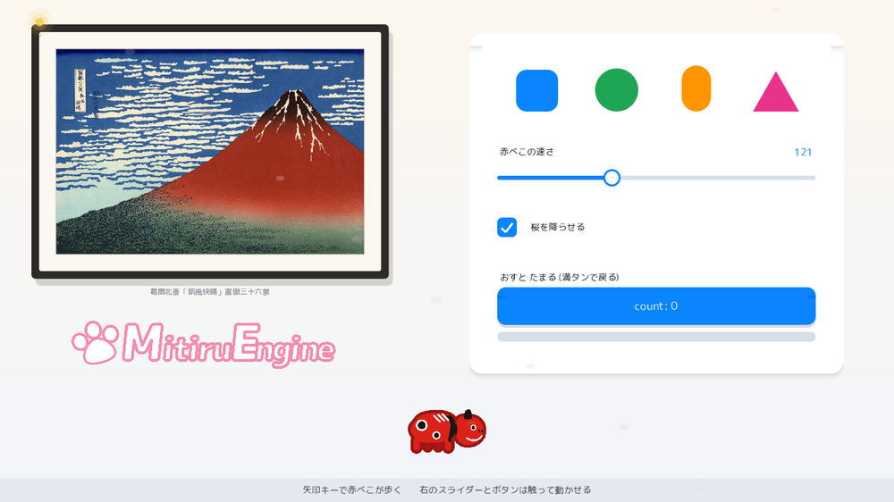
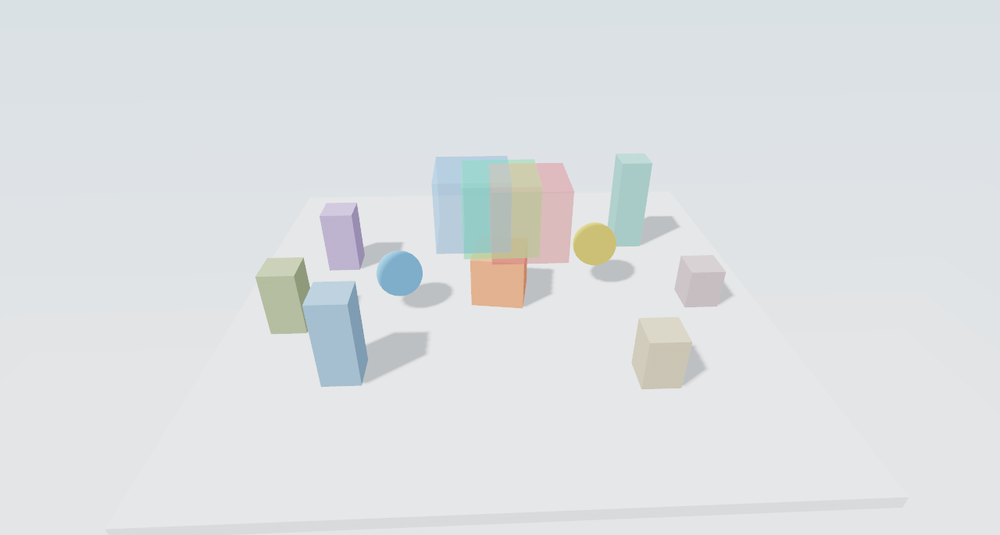

# MitiruEngine

軽量な C++ ゲームエンジン。ルールは C++、画面は HTML / CSS で書きます。



<sub>同梱の <code>welcome</code> 例。矢印キーで赤べこが歩き、右のスライダーやボタンは触って動かせます。パネルはすべて HTML / CSS です。</sub>

「必要なものしか画面に出さない」という考え方で作っています。Unity / Godot のような全機能を 1 画面に集めた mega editor の対極で、1 ツール = 1 関心事 = 1 ウィンドウ。GUI editor は提供せず、CLI を入口の中心に置きます。IDE は任意で、メモ帳でも開発できます。

ゲーム本体はホットリロードできる DLL です。host（`mitiru_host`）がそれを読み込んでメインループを回します。状態は 1 個の `struct`（ポインタを持たない、まるごとコピーできる数値だけのかたまり）にまとめ、それをエンジンが預かります。この 1 点から、巻き戻し・録画・観察・セーブが同じ仕組みで出てきます。

- 対応 OS: Windows 10 / 11（x64）
- 言語: C++20
- 入力: キーボード / マウス / ゲームパッド（Xbox 系・DualShock 4 など、設定不要）
- 画面 (UI): HTML / CSS（CEF）または C++ から直接描画
- 公式サイト: https://mogmog-0110.github.io/MitiruEngine/

## なぜ MitiruEngine か

- **HTML / CSS で UI が書ける。** メニューや HUD を Web ページと同じ書き方で組めます。C++ が送った値を `data-m-*` を書いた要素が受け取るので、つなぎの JavaScript は書きません。
- **巻き戻し。** 毎フレームの状態を記録し、過去の瞬間へゲームをまるごと巻き戻して観察できます。「なぜこの値になったか」を遡って 1 行を特定できます。
- **決定論 + リプレイ。** 同じ入力なら同じ結果になります。録画した入力がそのまま回帰テストになります。
- **各 subsystem を単独起動できる。** Renderer / Audio / Input / Scene などを、ゲーム全体を立ち上げずに個別の CLI コマンドで動かせます。
- **状態が 1 個のかたまり。** 状態をまるごとコピーできる 1 個の `struct` に置くので、エンジンが状態を読み・差分を取り・巻き戻せます。観察も AI 連携も同じ源から成立します。Claude Code / Codex などの AI エージェントが、この状態に対して開発できます。
- **道具は 1 つにつき 1 ウィンドウ。** 巨大なエディタは開きません。観察ウィンドウ・入力モニタ・巻き戻しウィンドウなどは別々の OS ウィンドウとして独立します。
- **ホットリロード。** C++ も HTML / CSS も、保存した瞬間に走行中のゲームへ反映されます。状態は保たれます。

## クイックスタート

```bash
mitiru new my-game
cd my-game
mitiru run
```

`mitiru new` の既定テンプレートは、描画・入力・HTML/CSS の HUD・HTML ボタンを 1 画面で見せるショーケースです。`mitiru run` の代わりに `mitiru watch` で起動すると、`src/` を編集して保存するたびに、状態を保ったままホットリロードします。

ゲームの最小形は、状態の `struct` に `update` と `draw` を書くだけです。

```cpp
#include <mitiru.hpp>
using namespace mitiru;

struct MyGame {
    float x = 640, y = 360;

    void update(Input in, float dt) {
        x += in.move().x * 600 * dt;   // 矢印 / WASD / 左スティックが合流する
    }
    void draw(Screen& s) {
        s.fillCircle(x, y, 24, color::Cyan);
    }
};
MITIRU_GAME(MyGame)   // この struct をゲームの入口にする
```

`update(Input in, Hud hud, float dt)` のように `Hud hud` を足すと、HTML への値の送信や観察ウィンドウを扱えます。

## HTML / CSS で UI を書く

スコアなどの表示を C++ から HTML の HUD に渡せます。HTML 側は `data-m-text="名前"` で受け、C++ 側は `hud.set("名前", 値)` で送ります。名前を一致させるのが唯一の約束で、つなぎの JavaScript は要りません。

```html
<!-- scene.html -->
<div class="hud">SCORE <span data-m-text="view.hud.score">0</span></div>
```

```cpp
void update(Input in, Hud hud, float dt) {
    // …
    hud.set("view.hud.score", score);   // scene.html の同じ名前へ届く
}
```

`scene.html` と CSS もホットリロードの対象です。DLL を再ビルドせずに、保存した瞬間に画面が更新されます。

## 主な機能



<sub>同梱の <code>scene3d</code> 例。GPU 3D（半透明の順不同合成 WBOIT ＋ 影 ＋ skybox）。</sub>

- 2D 描画（スプライト / タイルマップ / グラデーション / 図形 / テキスト）と 3D（glTF の読み込みと表示、影・半透明・skybox）
- 矩形・点の当たり判定（物理バックエンド Box2D / Jolt / NativeEngine は任意で有効化）
- HTML / CSS の UI オーバーレイ（CEF）と、C++ の値を受ける `data-m-*` 属性
- 状態を 1 個のかたまりに置く設計（`MITIRU_GAME` / `MITIRU_GAME_SERIES`）
- 巻き戻し・観察ウィンドウ・入力モニタ・録画再生などのデバッグウィンドウ（`hud.open(Tool::…)` で開く）
- 決定論的リプレイ（入力 + 乱数 seed の記録・再生）
- 各 subsystem の単独起動
- ホットリロード（C++ / HTML / CSS）
- AI 観測 API（状態の構造化 JSON・フレーム間の差分・別世界での再実行）
- 配布フォルダの生成（`mitiru dist`、コンソールを出さない exe + ランタイム同梱）

## リンク

- 公式サイト: https://mogmog-0110.github.io/MitiruEngine/
- チュートリアル（小さなゲームを 1 本作る）: https://mogmog-0110.github.io/MitiruEngine/tutorial.html
- 機能リファレンス: https://mogmog-0110.github.io/MitiruEngine/features.html
- AI 連携: https://mogmog-0110.github.io/MitiruEngine/ai.html
- ダウンロード（GitHub Releases）: https://github.com/mogmog-0110/MitiruEngine/releases/latest
- CLI リポジトリ: https://github.com/mogmog-0110/mitiru-cli

## ライセンス

ソース公開のライセンスです。ゲーム制作には自由に使えます（商用も可）。ただしエンジン本体の改変・再配布はできません。詳細は `LICENSE` を参照してください。
