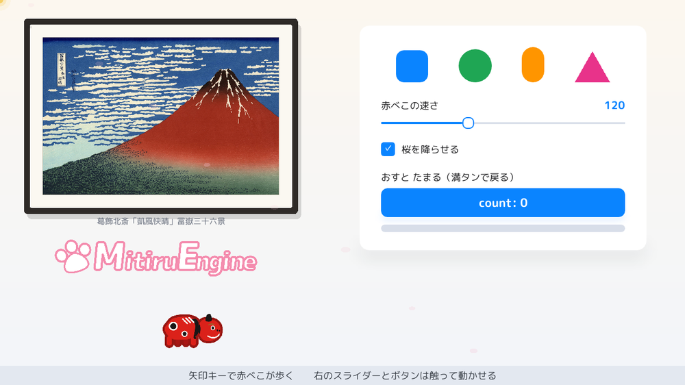
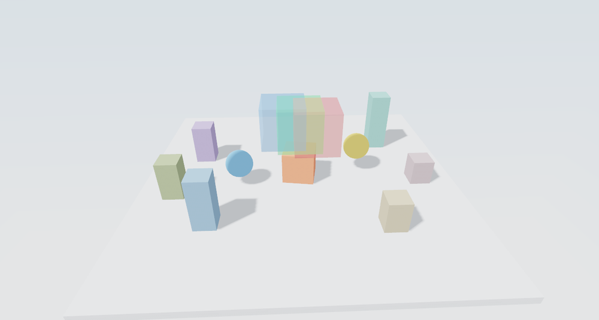

# MitiruEngine

軽量なC++ゲームエンジン。ルールはC++、画面は RML / RCSS (HTML / CSS の方言) で書きます。



<sub><code>mitiru new</code> で作った直後の画面です。矢印キーで赤べこが歩き、右のスライダーやボタンは触って動かせます。左の絵は C++ が描き、右のパネルは RML / RCSS です。</sub>

「必要なものしか画面に出さない」という考え方で作っています。Unity / Godotのような全機能を1画面に集めたmega editorの対極で、1ツール = 1関心事 = 1ウィンドウ。GUI editorは提供せず、CLIを入口の中心に置きます。IDEは任意で、メモ帳でも開発できます。

ゲーム本体はホットリロードできるDLLです。host（`mitiru_host`）がそれを読み込んでメインループを回します。状態は1個の`struct`（ポインタを持たない、まるごとコピーできる数値だけのかたまり）にまとめ、それをエンジンが預かります。この1点から、巻き戻し・録画・観察・セーブが同じ仕組みで出てきます。

- 対応OS: Windows 10 / 11（x64）
- 言語: C++20
- 入力: キーボード / マウス / ゲームパッド（Xbox系・DualShock 4など、設定不要）
- 画面(UI): RML / RCSS（RmlUi）またはC++から直接描画
- 公式サイト: https://mogmog-0110.github.io/MitiruEngine/

## 作るものから始める

| 作りたいもの | 始め方 | 最初に読むページ |
|---|---|---|
| 2D のゲーム | `mitiru new my_game` (既定の welcome)。縦スクロールの STG は `-t shooter`、放置系は `-t clicker` | [はじめてのゲーム](https://mogmog-0110.github.io/MitiruEngine/tutorial.html) |
| 3D アクション | `mitiru new my_game -t action3d` | [3D アクションを作る](https://mogmog-0110.github.io/MitiruEngine/action.html) (6 ページ) |
| メニューや会話の多いゲーム | `mitiru new my_game` (welcome は RML / RCSS の画面付き) | [docs/UI_RMLUI.md](docs/UI_RMLUI.md) |
| オンライン協力 | テンプレートは無い。ローカルの多人数として書き、host の `--net` でつなぐ (エンジンを GekkoNet 付きでビルドしたときだけ) | [docs/ONLINE.md](docs/ONLINE.md) |

`mitiru` の入れ方は [docs/GETTING_STARTED.md](docs/GETTING_STARTED.md)。

## なぜMitiruEngineか

- **RML / RCSS で UI が書ける。** メニューや HUD を HTML / CSS とほぼ同じ書き方で組めます。C++ が送った値を RML の `{{ 名前 }}` が受け取るので、スクリプトは書きません。
- **巻き戻し。** 毎フレームの状態を記録し、過去の瞬間へゲームをまるごと巻き戻して観察できます。「なぜこの値になったか」を遡って1行を特定できます。
- **決定論 +リプレイ。** 同じ入力なら同じ結果になります。録画した入力がそのまま回帰テストになります。
- **各subsystemを単独起動できる。** Renderer / Audio / Input / Sceneなどを、ゲーム全体を立ち上げずに個別のCLIコマンドで動かせます。
- **状態が1個のかたまり。** 状態をまるごとコピーできる1個の`struct`に置くので、エンジンが状態を読み・差分を取り・巻き戻せます。観察もAI連携も同じ源から成立します。Claude Code / CodexなどのAIエージェントが、この状態に対して開発できます。
- **道具は1つにつき1ウィンドウ。** 巨大なエディタは開きません。観察ウィンドウ・入力モニタ・巻き戻しウィンドウなどは別々のOSウィンドウとして独立します。
- **ホットリロード。** C++ も RML / RCSS も、保存した瞬間に走行中のゲームへ反映されます。状態は保たれます。

## クイックスタート

```bash
mitiru new my-game
cd my-game
mitiru run
```

`mitiru new`の既定テンプレートは、描画・入力・RML / RCSS の HUD・ボタンを1画面で見せるショーケースです。`mitiru run`の代わりに`mitiru watch`で起動すると、`src/`を編集して保存するたびに、状態を保ったままホットリロードします。

ゲームの最小形は、状態の`struct`に`update`と`draw`を書くだけです。

```cpp
#include <mitiru.hpp>
using namespace mitiru;

struct MyGame {
    float x = 640, y = 360;

    void update(Input in, float dt) {
        x += in.move().x * 600 * dt;   // 矢印 / WASD / 左スティックが合流する
    }
    void draw(Screen& s) {
        s.fillCircle(x, y, 24, color::Cyan);
    }
};
MITIRU_GAME(MyGame)   // この struct をゲームの入口にする
```

`update(Input in, Hud hud, float dt)`のように`Hud hud`を足すと、UI への値の送信や観察ウィンドウを扱えます。

## RML / RCSS で UI を書く

スコアなどの表示を C++ から HUD に渡せます。ゲームの DLL の隣に `assets/ui/main.rml` を置き、C++ 側は `hud.set("view.名前", 値)` で送り、RML 側は `data-model="view"` の中で `{{ 名前 }}` と書いて受けます。名前を一致させるのが唯一の約束で、スクリプトは要りません。

```html
<!-- assets/ui/main.rml -->
<rml>
<head><link type="text/rcss" href="mitiru:base.rcss"/></head>
<body data-model="view">
  <div class="hud">SCORE {{ score }}</div>
</body>
</rml>
```

```cpp
void update(Input in, Hud hud, float dt) {
    // …
    hud.set("view.score", score);   // main.rml の {{ score }} へ届く
}
```

`.rml` と `.rcss` もホットリロードの対象です。DLL を再ビルドせずに、保存した瞬間に画面が更新されます。

## 主な機能



<sub>同梱の<code>scene3d</code>例。GPU 3D（半透明の順不同合成WBOIT ＋ 影 ＋ skybox）。</sub>

- 2D描画（スプライト / タイルマップ / グラデーション / 図形 / テキスト）と3D（glTFの読み込みと表示、影・半透明・skybox）
- 矩形・点の当たり判定（物理バックエンドBox2D / Jolt / NativeEngineは任意で有効化）
- RML / RCSS の UI オーバーレイ（RmlUi）と、C++ の値を受ける `{{ }}` / `data-*` の書き方
- 状態を1個のかたまりに置く設計（`MITIRU_GAME` / `MITIRU_GAME_SERIES`）
- 巻き戻し・観察ウィンドウ・入力モニタ・録画再生などのデバッグウィンドウ（`hud.open(Tool::…)`で開く）
- 決定論的リプレイ（入力 +乱数seedの記録・再生）
- 各subsystemの単独起動
- ホットリロード（C++ / RML / RCSS）
- AI観測API（状態の構造化JSON・フレーム間の差分・別世界での再実行）
- 配布フォルダの生成（`mitiru dist`、コンソールを出さないexe +ランタイム同梱）

## リンク

- 公式サイト: https://mogmog-0110.github.io/MitiruEngine/
- チュートリアル（小さなゲームを1本作る）: https://mogmog-0110.github.io/MitiruEngine/tutorial.html
- 機能リファレンス: https://mogmog-0110.github.io/MitiruEngine/features.html
- AI連携: https://mogmog-0110.github.io/MitiruEngine/ai.html
- ダウンロード（GitHub Releases）: https://github.com/mogmog-0110/MitiruEngine/releases/latest
- CLIリポジトリ: https://github.com/mogmog-0110/mitiru-cli

## ライセンス

ソース公開のライセンスです。ゲーム制作には自由に使えます（商用も可）。ただしエンジン本体の改変・再配布はできません。詳細は`LICENSE`を参照してください。同梱している第三者ソフトウェアとフォントのライセンスは`THIRD_PARTY_NOTICES.txt`にまとめてあります。
