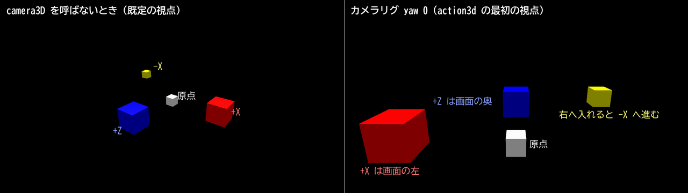

# 3D アクションの部品 (mitiru/action/)

game DLL が自分でリンクし、同じフレームの中で使う header-only のライブラリ。host に頼む問い合わせ
(`hud.raycast`、ADR 0038) は答えが次のフレームに返るので、キャラの移動やカメラ、攻撃の判定には遅い。
ここの部品は DLL の中で解くので、答えはその場で返る。host は呼ばない (ADR 0005)。ABI も変えない。

見本は `examples/action3d/`。

## データの置き場所

| データ | 置き場所 | 理由 |
|---|---|---|
| 地形 (`CollisionLevel`) | DLL の static | 作ったら変えない。std::vector を持つので GameMemory に入らない。DLL を読み込むたび (ホットリロードを含む) に作り直す |
| 動く足場 (`MovingBody`) | GameMemory | 姿勢は遊びの状態。前の tick の姿勢も持ち、乗っているものを運ぶ量を出す |
| キャラ・カメラ・判定・先行入力の状態 | GameMemory | すべて POD。巻き戻しと記録／再生がそのまま効く |

地形を作り直しても、同じファイルから同じ順で作れば同じ BVH になる (構築も決定論)。だから巻き戻しや
リプレイの途中でホットリロードしても答えは変わらない。

## 地形を作る

```cpp
const mitiru::action::CollisionLevel kLevel = [] {
    mitiru::action::CollisionLevelBuilder b;
    mitiru::physics3d::MeshColliderLibrary meshes;
    addMeshFile(b, meshes, "mygame/assets/stage.gltf", 0);       // 描画と同じファイル
    addCollisionJsonFile(b, "mygame/assets/stage_extra.json");     // --collision と同じ書式
    b.addBox({-1, 0, -1}, {1, 2, 1}, 3);                           // 手で足す箱 (layer 3)
    return b.build();
}();
```

Blender から書き出したレベル ([LEVEL_FROM_BLENDER.md](LEVEL_FROM_BLENDER.md)) の当たり判定の面は 1 行で地形になる。

```cpp
static mitiru::level::LevelFile g_stage("mygame/assets/stage.glb");
const mitiru::action::CollisionLevel kLevel = mitiru::action::buildLevelCollision(g_stage.get());
```

箱などと混ぜるときは builder に `addLevelCollision(b, g_stage.get(), layer)` で足す。

- 三角形の id は足した順の通し番号。当たりの結果にそのまま返るので、面の種類 (氷、溶岩) の表を引ける。
- layer は 0-31。問い合わせの mask の `1 << layer` と照らす。
- エレベーターのように形が決まっていて姿勢だけ動く部品は `addMovableMesh` で足し、`MovingBody{shape = Mesh}` で置く。
  箱だけの足場は地形に足さず、`MovingBody{shape = Box}` だけで済む。

## 問い合わせ (CollisionWorld)

`CollisionWorld world(&kLevel, game.platforms);` を毎フレーム作る (中身はポインタ 2 つ)。

| 関数 | 返すもの |
|---|---|
| `raycast` | 一番近い当たり (点、法線、距離、body、三角形の id、layer) |
| `sphereCast` / `capsuleCast` | 動かしたときの最初の当たり。開始時に重なっていれば `startPenetrating` |
| `overlapSphere` / `overlapCapsule` | 触れている三角形を深い順に。body と三角形の id 付き |
| `closestPoint` | 一番近い地形の点 |
| `carryDelta` | 足場が直前の tick に点をどれだけ動かしたか |

判定は両面。同じ距離の当たりは (地形、足場の並び、三角形の id) の順で 1 つに決めるので、BVH を使っても
総当たりと同じバイト列になる (`TestActionCollision` が乱数のレイと掃引で確かめている)。

## キャラクター (stepCharacter)

カプセルを掃引して滑らせる。`CharacterInput` に望む水平速度と跳ぶ速さを渡す。加減速や慣性はゲームが決める。

- 坂か壁かは三角形の面法線で決める (`maxSlopeDeg`)。段差の角に触れても、床の三角形に乗っていれば床。
- `stepHeight` 以下の段は上る。平らな段の縁では足元を上面に合わせ、階段でも速さが落ちない。
- 接地中は下へ `snapDistance` まで吸い付く (下り坂や階段で浮かない)。
- 足場に乗ると足場ごと運ばれ、跳ぶと足場の速度を持って離れる。
- `gravity` の逆が上。重力を +Y にすれば天井を歩く。
- `CharacterInput::up` を渡すと、その tick の上がそれになる (ループ、壁走り、小さな星)。重力は大きさ `|gravity|` のまま
  `-up` へ向き、段差・坂の上限・吸着・壁と天井の区別・足場に運ばれる処理もすべてこの上で決める。上が変わって今の地面が
  坂の上限より急になれば、地面を離れて新しい重力の向きへ落ちる。上を地面の法線へ寄せるのはゲームの側
  (例: 前の tick の `groundNormal` をそのまま渡す)。0 のままなら今までと同じ計算で、結果もビットまで同じ。

## 攻撃判定 (Combat.hpp)

時間は tick の整数で数える (フレームデータをそのまま書ける)。

- `Hitbox` はボーンの座標系の形と、前の tick と今のボーンの姿勢を持つ。`resolveHits` はその間を掃引する
  (回転は slerp なので、剣を振る弧の内側を取りこぼさない)。
- `HitExclusion` は 1 振りで当てた相手の記録。振りを始めるときに `begin()`。`rehitFrames` で多段ヒット。
- `HitStop` と `Invulnerability` は残りの tick だけを持つ。`HitStop` は持ち主ごとに止めるときに使う。
  画面全体を止めるのは `hud.hitStop(秒)` で、その間も update は dt = 0 で呼ばれ続ける。
- 判定に使うボーンの姿勢は、シミュレーションの側で CPU で評価した値を渡す (GPU スキニングの結果は使わない)。

`InputBuffer` は押した瞬間を覚え、行動ごとの猶予 (`ActionWindows`) の間なら後から使える。
`tryCancel` は技の取り消し窓が開いているときだけ、優先順に先行入力を使う。

## ソフトロック (SoftLock.hpp)

`softLock` は攻撃の出だしに、前の円錐 (`halfAngleDeg`) と射程 (`range`) の中から狙う相手を 1 体選び、
そちらへ最大 `maxTurnDeg` だけ向き直った前と yaw を返す。点数は「距離 / 射程 + `angleWeight` × 角度 / 半角」で、
小さい方を選ぶ。同点は添字の小さい方。向きと距離は `up` に垂直な面で測り、高さの差は見ない。

## カメラ (updateCameraRig)

返す `CameraView` を `Screen::camera3D(view.eye, view.target, view.up, view.fovDeg, nearDist, farDist)` に渡す。
傾きは `up` に入っているので rollDeg は渡さなくてよい。近い面と遠い面はステージの大きさに合わせてゲームが決める
(既定は 0.1 と 500。遠い面を詰めるほど深度の精度が上がる)。yaw 0 の視線は北 (既定は +Z)、
右スティックを右へ倒すと画面の右 (`cross(視線, 上)`) へ回る。

- `CameraRigInput::up` にキャラの上を渡すと、リグの上 (`CameraRigState::up`) が `upFollowRate` でそちらへ寄る。
  北も同じ回転で運ぶので、上が視線の向きを通り過ぎても画面は裏返らない。上が真逆へ変わるときは視線の水平な向きを
  軸にして回る。0 のままならワールドの +Y で、今までと同じ計算になる。
- `CameraRigInput::rollDeg` は視線まわりに足す傾き (正で画面の右へ)。`CameraView::up` が傾きを含む画面の上、
  `CameraView::rollDeg` はそれを camera3D の基準 (ワールドの +Y) からの角度に直したもの。
- キャラを画面の向きで歩かせるときは `cameraRigForward(state)` と `cameraRigRight(forward, state.up)` を使う。

- 腕は壁に当たるとその場で縮み、壁が無くなっても `recoverDelay` 秒待ってから伸びる。目の球を掃引して決めるので、
  目は地形の中に入らない。
- ロックオンでは注視点を自分と相手の重み付きの中点へ寄せ、2 人が画面の `lockScreenRatio` に収まる長さまで腕を伸ばす。

### 画面の左右と座標の向き

座標は右手系で Y が上。yaw 0 のリグは +Z を向くので、+X は画面の左、-X は右に出る。右へ入れたときに進む向き
(`cameraRigRight`) は -X になる。`camera3D` を呼ばないときの既定の視点は、目 (6, 5, 8) から (0, 0.5, 0) を見る。



赤は (3, 0.5, 0)、青は (0, 0.5, 3)、白は原点、黄は `cameraRigRight` の向きへ 2 m の位置に置いた箱で、
`mitiru_host --headless-3d` で撮った。攻撃の当たりのように向きが要る計算は、「+X が右」と決めずに、
カメラの前と右から組んだ移動の向き (テンプレート action3d の `facing`) を使う。

## 骨の姿勢と本物の剛体

判定に使う骨の姿勢、武器のソケット、ルートモーション、アニメのイベントは、アニメのランタイム
([ANIMATION_RUNTIME.md](ANIMATION_RUNTIME.md)) を DLL の中で回して同じフレームに得る。描画 (`drawModelPose`) と同じ関数なので、
画面の骨と判定の骨は一致する。

キャラ、カメラ、攻撃判定は上の部品で足りる。ラグドールや押せる物のように本物の剛体が要るときは、Jolt の world を
DLL の中に持ち、GameMemory の外の窓口 (ADR 0054、[SIDE_STATE.md](SIDE_STATE.md)) に預けて巻き戻す。見本は `examples/physics_rewind/`。
